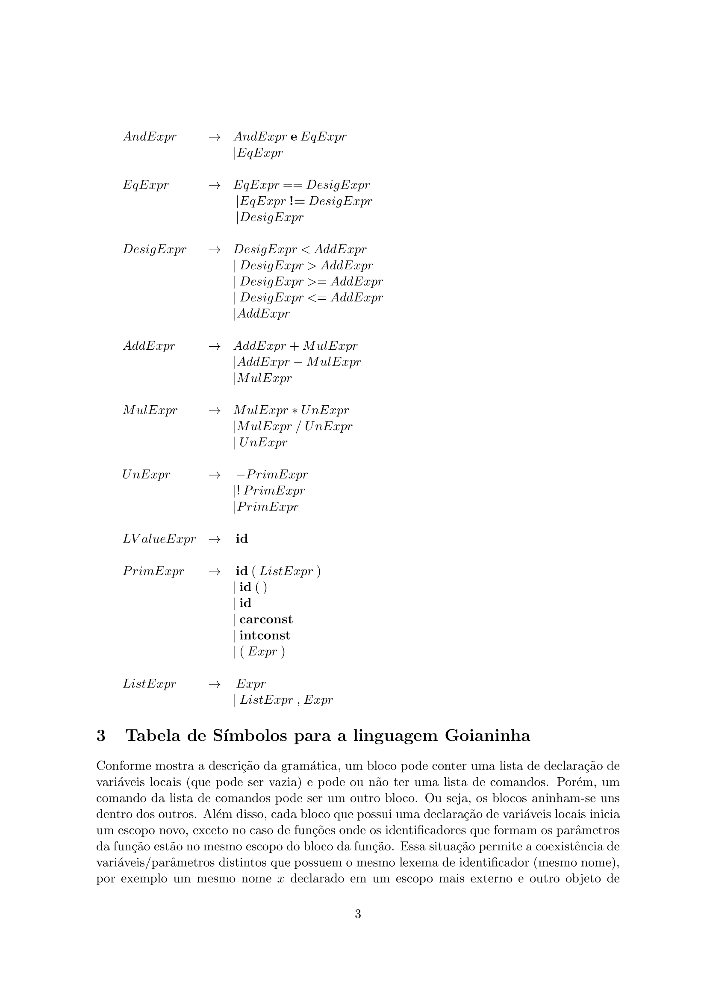

# Atividade





# Execução

Para executar o análisador léxico é necessário construir o executavel com o seguinte comando:

```bash
make lex
```

Em seguida, é possível executar o programa com o seguinte comando:

```bash
./lex arquivo_de_teste
```

Onde `arquivo_de_teste` é o nome do seu arquivo de teste da linguagem *goianinha*.