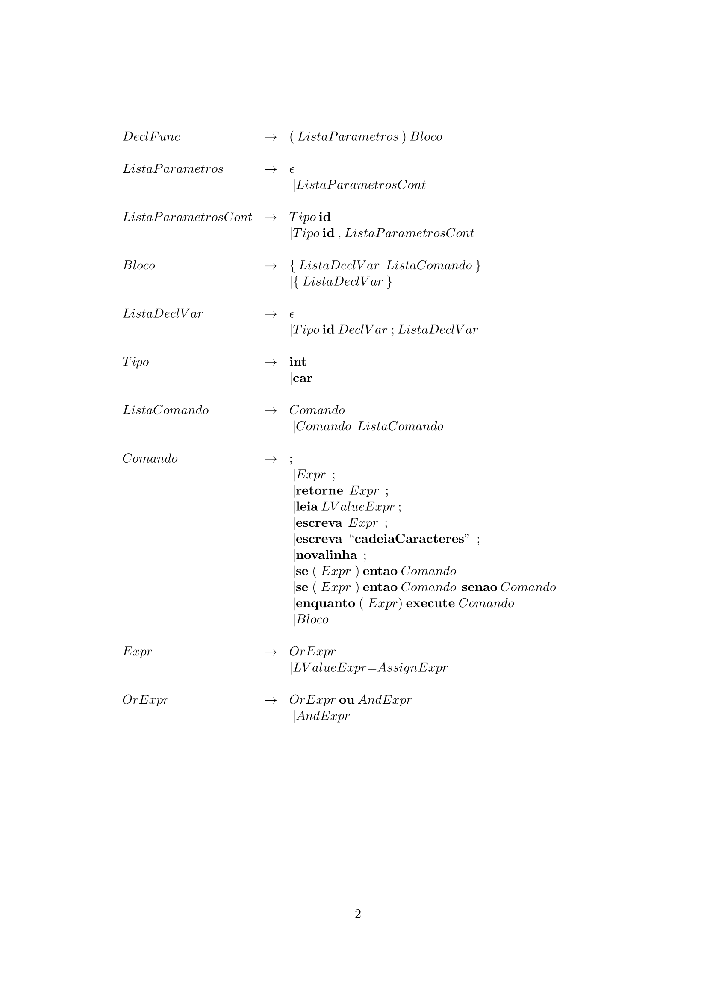
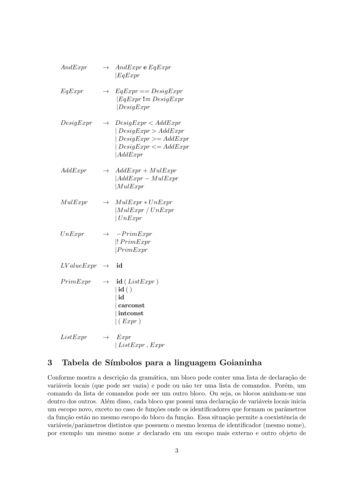
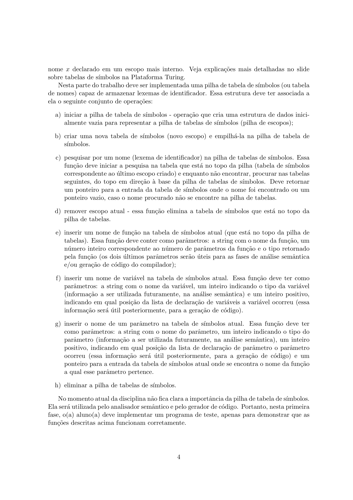
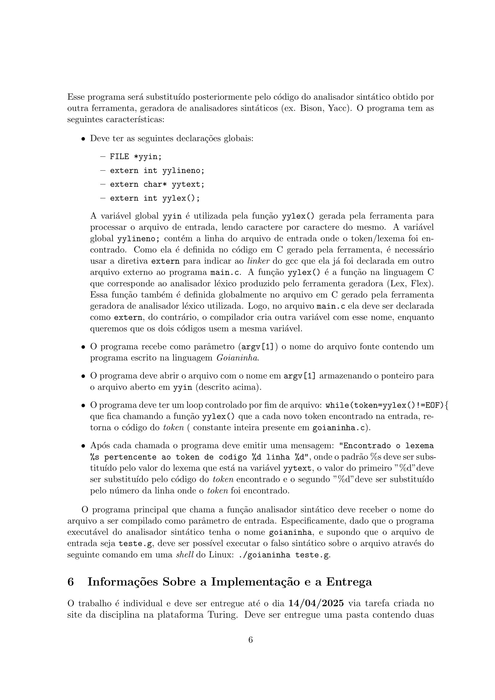
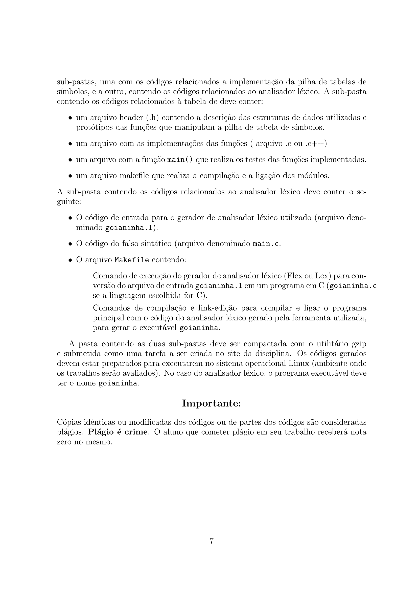

# Atividade










# Execução

## Step 1

Criar arquivo `file-name.l`.

## Step 2

Compilar com o comando:

```bash
flex file-name.l
```

## Step 3

Compilar utilizando o gcc:

```bash
gcc lex.yy.c -o file-name
```