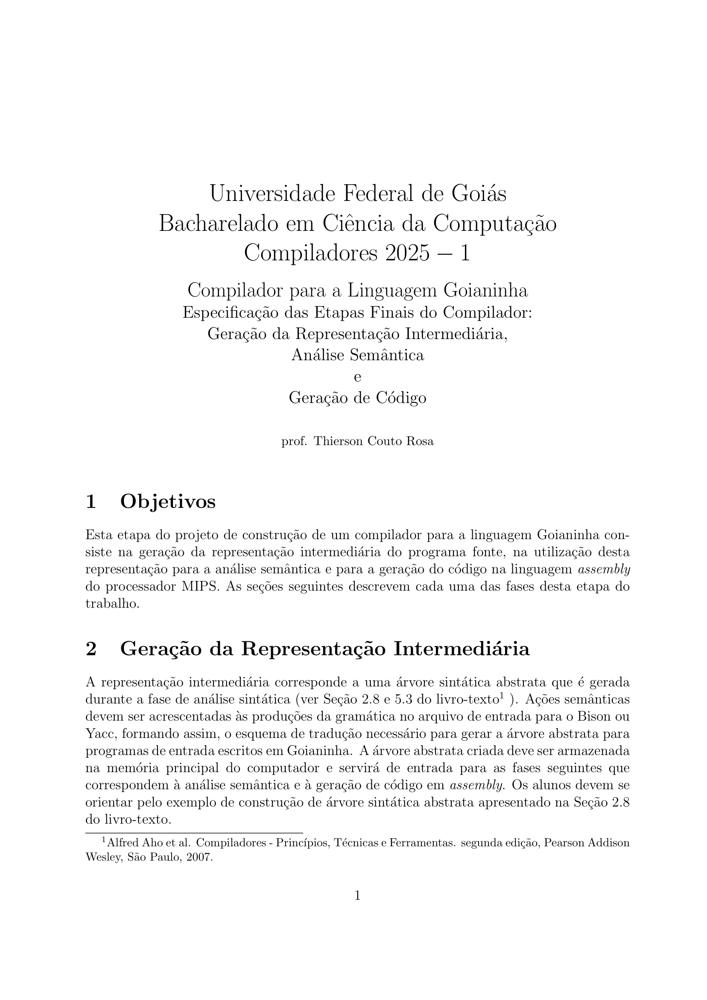
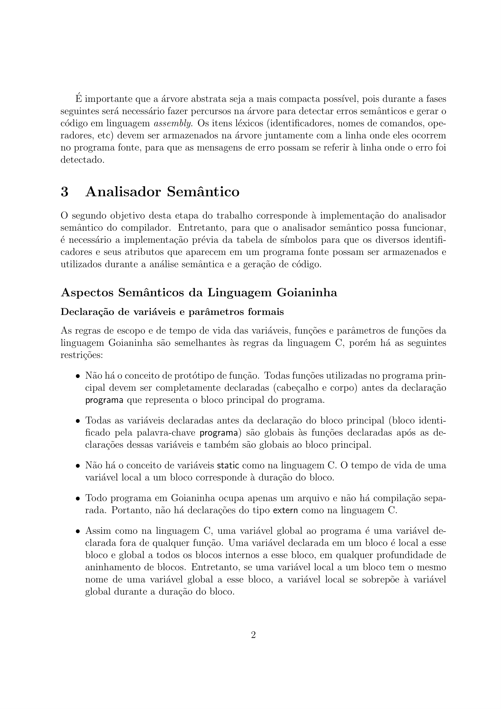
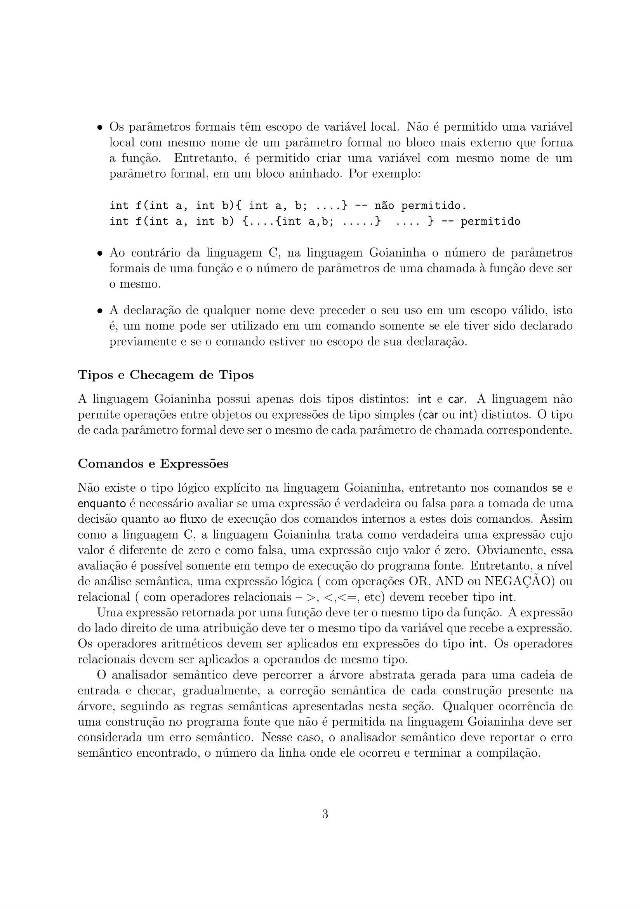
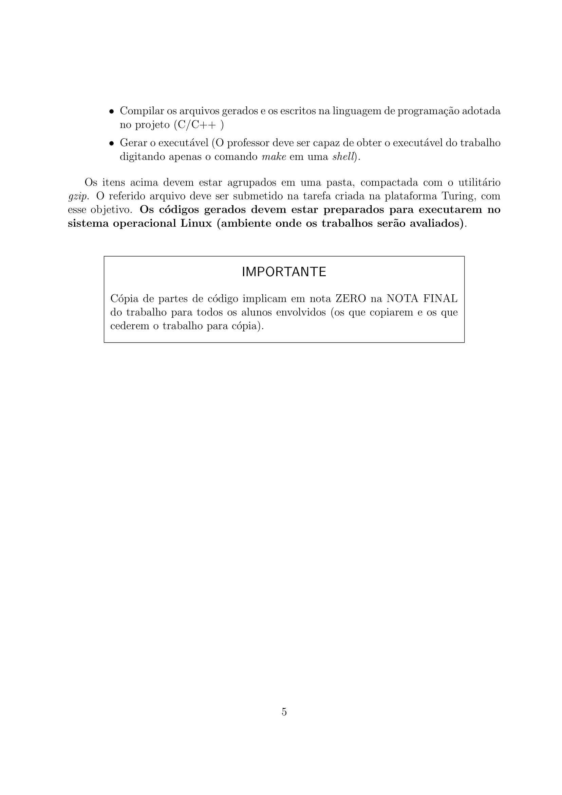

# Trabalho T3 - Análise Semântica e Geração de Código







# Execução

Para executar o análisador léxico é necessário construir o executavel com o seguinte comando:

```bash
make goianinha
```

Em seguida, é possível executar o programa com o seguinte comando:

```bash
./goianinha.exe arquivo_de_teste
```

Onde `arquivo_de_teste` é o nome do seu arquivo de teste da linguagem *goianinha*.